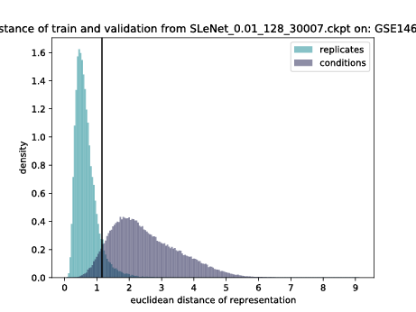
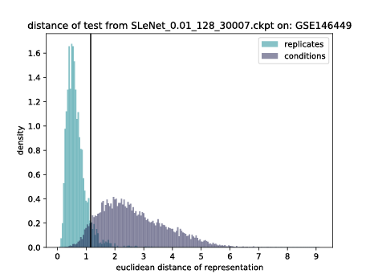
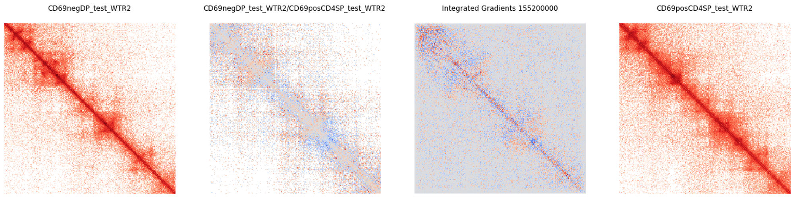
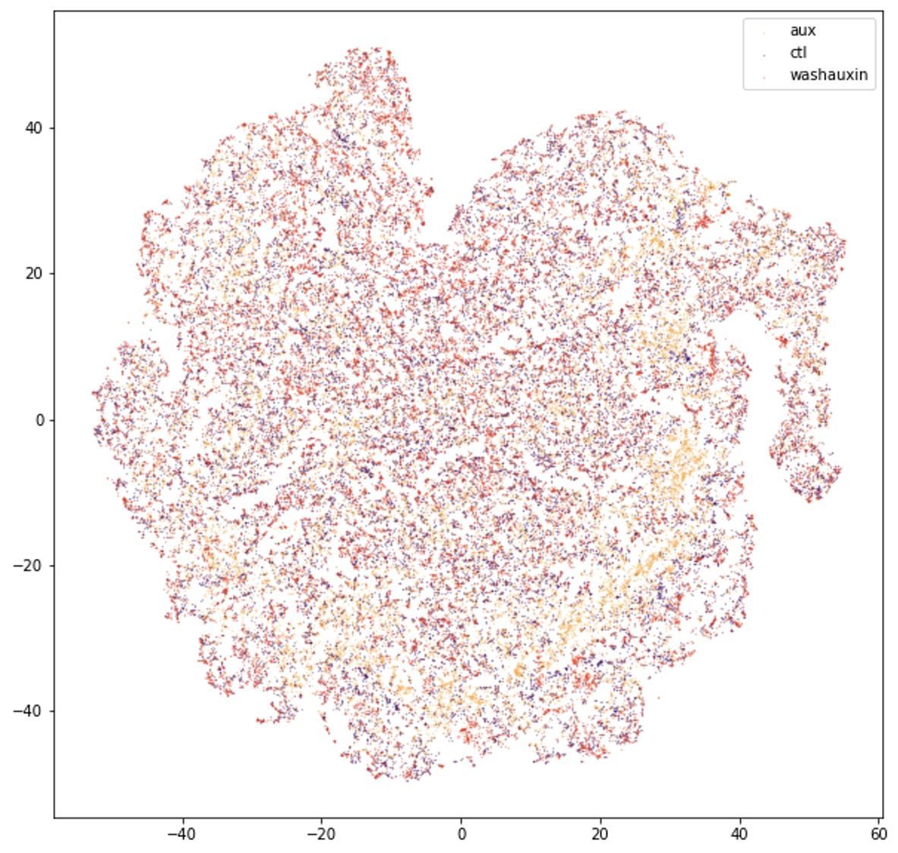
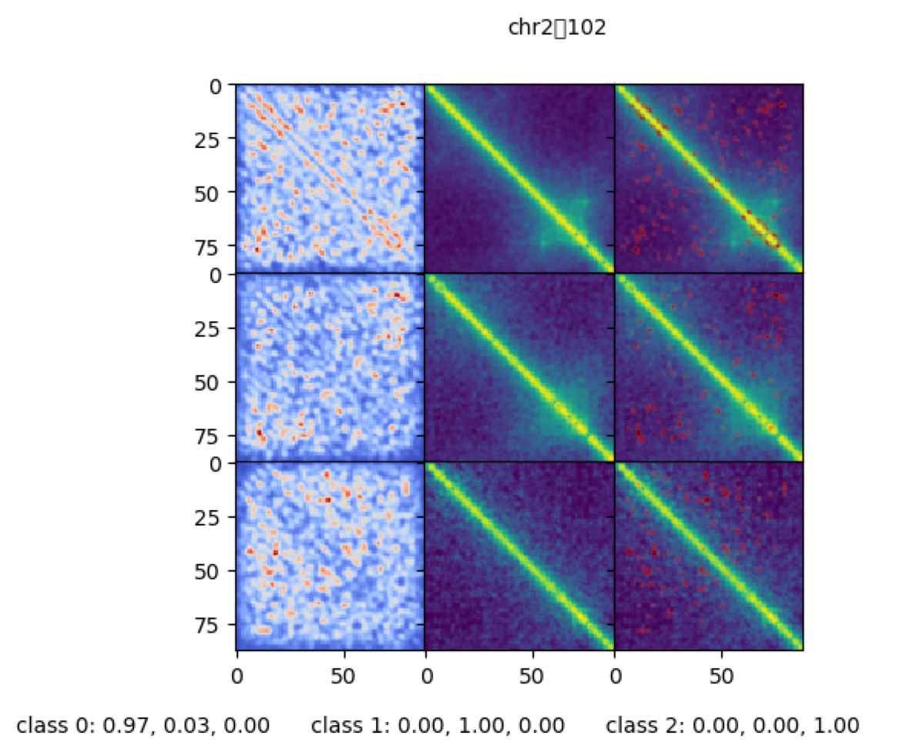
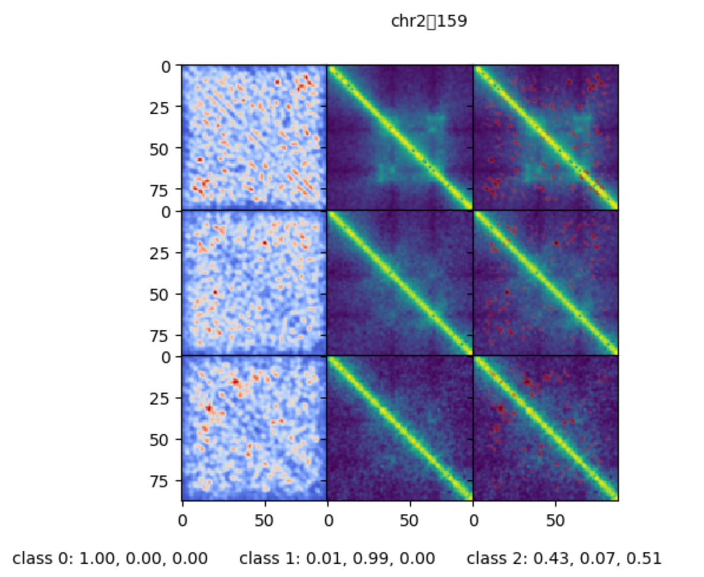
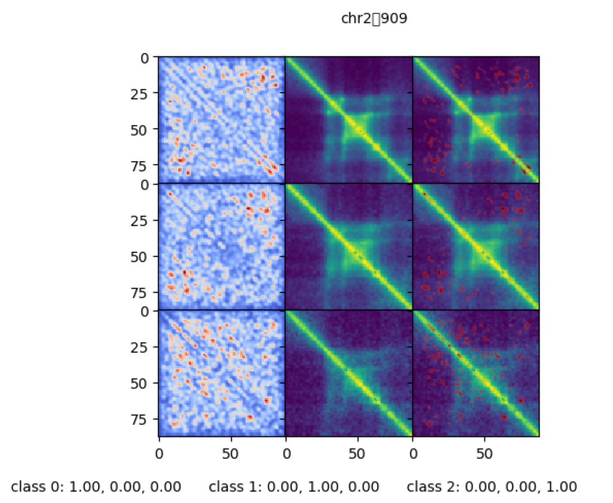
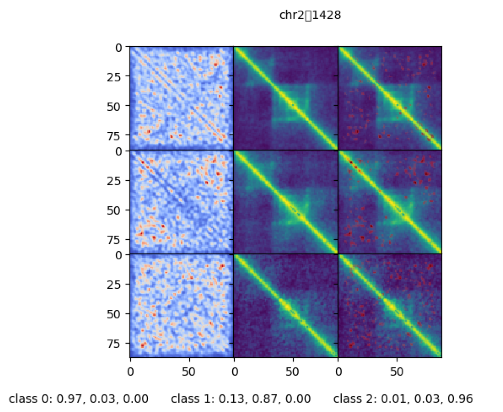

# Hi-SiNet
This module contains an efficient data laoder and training structure for Hi-C data. The aim is to learn patterns from observations made along the diagonal of the Hi-C maps. This data is made up of reads which have typically been aligned, processed and normalised using either the HiCPro or the distiller pipeline. The resultant files of the format `.hic` or `.mcool` can be used as inputs for Hi-SiNet. 

## Installation and Testing

### Requirements 

### Installation 

### Testing 

## Load Hi-C Data 
Load Hi-C data from a `.hic` using the HiCDatasetDec type. Saving imediately after initialising is recommended since the initialisation is time and memory intensive.

```
from HiCDataset import HiCDatasetDec
replicate_id = 'R1' #replicate identifier can be anything  
class_id = 0 #class identifier must be int 
data = HiCDatasetDec(['input.hic', replicate_id , 'KR', 'BP', class_id],10000,880000)
data.save('input.mlhic')
```
Data saved as .mlhic can then be reloaded. Data from multiple Hi-C experiment files can be emalgamated into one sequential dataset or into a siamese dataset (i.e. paired by genomic location). Many siamese datasets or Hi-C datsets can be joined together. 

```
data_condition1 = HiCDatasetDec.load('input.mlhic')
data_condition2 = HiCDatasetDec.load('input2.mlhic')
data_condition3 = HiCDatasetDec.load('input3.mlhic')

from HiCDataset import GroupedHiCDataset
grouped_dataset = GroupedHiCDataset([data_condition1,data_condition2, data_condition3], reference = 'mm9')

from HiCDataset import SiameseHiCDataset
siamese1 = SiameseHiCDataset([data_condition1, data_condition2]) 
siamese2 = SiameseHiCDataset([data_condition1, data_condition3])
grouped = GroupedHiCDataset( [siamese1, siamese2], reference = 'mm9')

```

## Run Train Models 

## Run Test Models

Models can be tested using the siamese_test.py script. Here a threshold is calculated using the train and validation for the separation of replicate pairs from condition pairs which is subsequentially used to calculate the percentage of replicate and condition pairs correctly identified. This script also produces two output plots one describing the train and validation distance distributions and the other the test. If the model has trained correctly without overfitting then these distibutions should be comparable. 

| Train |  Test |
| ------ | ------ |
|   | |

## Downstream

### Integrated Gradient maps 


### TSNE and other dimensionality reduction methods 



<!--- With data taken from .hic juicer dump files at 10kb, this repo produces small 880kb cleaned images which are partially overlapping from the diagonal on 
three biological phenotypes. The phenotypes are Wild Type, CTCF knockout and Rad21, CTCF double knockout and are all taken from mouse double positive thymocytes. 
The data is cleanded using split_files which is designed in order to minimize memory usage. The data can then bee loaded as a HiCclass dataset. 

The trained CNN is 78% accurate on the test chromosome (chr2), this data has been used in order to produce saliency maps by calling 

```
from torch_plus import visualisation
from plot_visualisations import quickplot_all_reps

GBP = visualisation.Guided(model) #visualisation.Vanilla(model) 
quickplot_all_reps(dataset,'chr2', index, GBP)
```
Where index is the position in chromosome - start position of the hic file in kb divided by 110000.

The aim of this work is to provide biological insights on differences between phenotypes  

## Results 
The outcome is very clear distances identified by the classifier as being of interest. Left to right the images displayed show the saliency map, the HiC map and 
the saliency map overlayed onto the Hi-C map. Top to bottom the images are wild type, CTCF knockout and CTCF, Rad21 Knockout.



This behaviour is replicable across many regions

|  |  |
| ------ | ------ |
|   |  |
|   |  | --->
